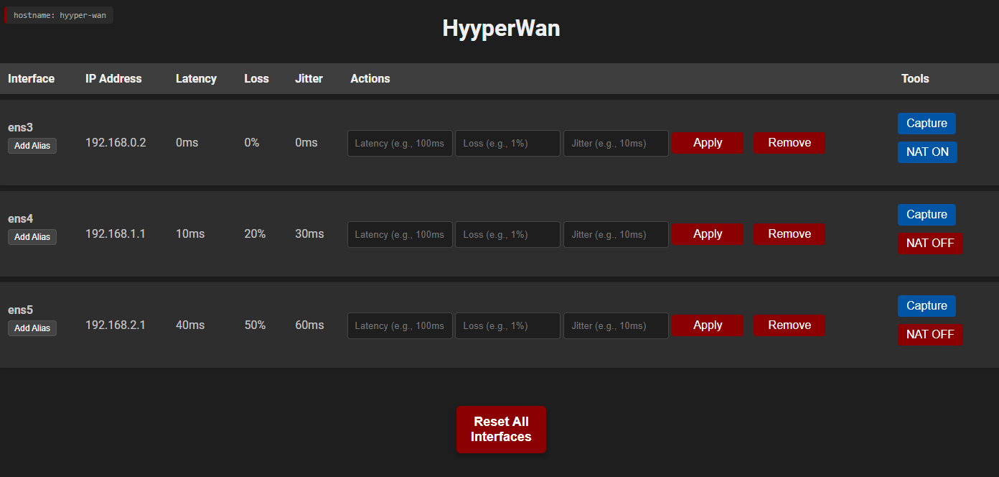

# HyyperWAN

HyyperWAN is a web application for emulating WAN conditions on Linux systems. It uses `tc qdisc` to apply latency, jitter, packet loss, and bandwidth limits to network interfaces, making it useful for testing SD-WAN, QoS, and other network-dependent features. The primary deployment method is as a Docker container running with `--net=host` so it controls the host's network stack directly.



---

## What's New

- **Admin page (`/admin`)** — Centralized configuration with optional password protection:
  - Per-interface controls: disable (grey out) latency, jitter, loss, bandwidth, Capture, and NAT independently
  - Global controls: hide Tools column, disable route/IP/MTU modifications, hide Admin navbar link
  - Interface aliases managed here instead of inline on the main table
  - Settings persisted to `data/admin_config.json` — mount a volume for persistence across container restarts
- **Bandwidth limiting** — Set a bandwidth cap per interface (kbit/mbit/gbit) in addition to or instead of latency/jitter/loss. Uses HTB+netem stacking when combining impairments.
- **Route table management** — View, add, and remove IPv4 and IPv6 routes on the host via a dedicated Routes page (uses `ip route`; changes are temporary).
- **Interface detail page** — Click the `↗` icon next to any interface to open a dedicated page with:
  - Live bandwidth graph (RX/TX bytes/sec, 60-second rolling window, 1s polling)
  - IPv4/IPv6 address management (add/remove via `ip addr`)
  - MTU configuration (`ip link set mtu`)
  - TC impairments panel with Capture and NAT buttons
- **Simultaneous HTTP + HTTPS** — A single image/process can now listen on both HTTP and HTTPS at the same time, controlled entirely by environment variables. The separate `hyyperwan-http` and `hyyperwan-https` images have been replaced by a single `hyyperwan:latest`.
- **UI overhaul** — Sticky navbar, theme switcher (Dark / Light), responsive layout, coloured status badges, and theme preference persisted in localStorage.
- **Consolidated Dockerfile** — Single `docker/Dockerfile` replaces the previous `Dockerfile.http` and `Dockerfile.https`.

---

## Features

- Set and control network latency, jitter, and packet loss per interface
- Bandwidth limiting per interface
- Enable/disable Source NAT (Masquerade) per interface
- Interface aliases for easier identification (persistent across restarts)
- Per-interface detail page with live bandwidth graph, IP address management, MTU setting, and Capture/NAT buttons
- Host route table view with add/remove (IPv4 and IPv6)
- Packet capture via tcpdump with host/network/port filters and PCAP download
- HTTP, HTTPS, or both simultaneously — controlled via environment variables
- Dark and Light UI themes (persisted in browser localStorage)
- Admin page (`/admin`) with optional password protection for centralized configuration and per-interface granular controls

---

## Requirements

**When run as a Docker container (recommended):**
- Docker
- The container must be run with `--net=host` and `--privileged`

**When run directly on the host:**
- Linux (tested on Ubuntu/Debian)
- Python 3.8+
- Root/sudo privileges
- `iproute2` (`ip`, `tc` commands)
- `tcpdump` (for packet capture)
- `iptables` (for Source NAT)

---

## Installation

### Option 1: Docker — GitHub Container Registry (recommended)

**HTTP only (default — port 8080):**
```bash
docker run -d --name hyyperwan \
  --net=host --privileged \
  --restart unless-stopped \
  ghcr.io/hyyperlite/hyyperwan:latest
```

**HTTPS only (port 8443) — uses baked-in self-signed certificate:**
```bash
docker run -d --name hyyperwan \
  --net=host --privileged \
  --restart unless-stopped \
  -e ENABLE_HTTP=false \
  -e ENABLE_HTTPS=true \
  ghcr.io/hyyperlite/hyyperwan:latest
```

**Both HTTP and HTTPS simultaneously — uses baked-in self-signed certificate:**
```bash
docker run -d --name hyyperwan \
  --net=host --privileged \
  --restart unless-stopped \
  -e ENABLE_HTTPS=true \
  ghcr.io/hyyperlite/hyyperwan:latest
```

**Custom ports:**
```bash
docker run -d --name hyyperwan \
  --net=host --privileged \
  --restart unless-stopped \
  -e HTTP_PORT=80 \
  -e HTTPS_PORT=443 \
  -e ENABLE_HTTPS=true \
  ghcr.io/hyyperlite/hyyperwan:latest
```

**Hide the Tools column (packet capture / NAT buttons):**
```bash
docker run -d --name hyyperwan \
  --net=host --privileged \
  --restart unless-stopped \
  -e DISABLE_TOOLS_COLUMN=true \
  ghcr.io/hyyperlite/hyyperwan:latest
```

**Bring your own certificate (optional):**

The image includes a baked-in self-signed certificate valid for 10 years. If you want to use your own certificate instead, mount it and override the paths:
```bash
docker run -d --name hyyperwan \
  --net=host --privileged \
  --restart unless-stopped \
  -e ENABLE_HTTPS=true \
  -e SSL_CERT_PATH=/certs/cert.pem \
  -e SSL_KEY_PATH=/certs/key.pem \
  -v /path/to/your/certs:/certs \
  ghcr.io/hyyperlite/hyyperwan:latest
```

To generate a self-signed certificate on your own host:
```bash
mkdir -p /etc/hyyperwan/certs
openssl req -x509 -newkey rsa:4096 -nodes \
  -out /etc/hyyperwan/certs/cert.pem \
  -keyout /etc/hyyperwan/certs/key.pem \
  -days 365
```

**Access the application:**
- HTTP:  `http://<host-ip>:8080`
- HTTPS: `https://<host-ip>:8443` (self-signed cert will produce a browser warning — accept/proceed)

**Stop / view logs:**
```bash
docker stop hyyperwan
docker logs hyyperwan
```

> **Security note:** `--net=host` and `--privileged` grant the container extensive access to the host. This is intentional — it is how HyyperWAN controls host network interfaces from inside the container.

---

### Option 1b: Docker — Air-gapped / No Internet Access

If the target server has no internet access, pull and export the image on a machine that does, then transfer it.

**On a machine with internet access:**
```bash
docker pull ghcr.io/hyyperlite/hyyperwan:latest
docker save ghcr.io/hyyperlite/hyyperwan:latest | gzip > hyyperwan.tar.gz
```

The image can also be downloaded directly from the GitHub Packages page:
**https://github.com/hyyperlite/hyyperwan/pkgs/container/hyyperwan**

**Transfer the file to the target server** (scp, USB, etc.):
```bash
scp hyyperwan.tar.gz user@target-server:/tmp/
```

**On the target server, load and run:**
```bash
docker load < /tmp/hyyperwan.tar.gz
docker run -d --name hyyperwan \
  --net=host --privileged \
  --restart unless-stopped \
  ghcr.io/hyyperlite/hyyperwan:latest
```

---

### Option 2: Build Docker Image from Source

Clone the repository and build the single unified Dockerfile:

```bash
git clone https://github.com/hyyperlite/hyyperwan.git
cd hyyperwan
docker build --no-cache -t hyyperwan -f docker/Dockerfile .
```

Then run using the same `docker run` examples shown in Option 1, replacing `ghcr.io/hyyperlite/hyyperwan:latest` with `hyyperwan`.

**Generating a self-signed certificate (if needed for HTTPS):**
```bash
mkdir -p certificates
openssl req -x509 -newkey rsa:4096 -nodes \
  -out certificates/cert.pem \
  -keyout certificates/key.pem \
  -days 365
```

---

### Option 3: Direct Installation (no Docker)

```bash
git clone https://github.com/hyyperlite/hyyperwan.git
cd hyyperwan
pip install -r requirements.txt
python app.py
```

The application will be accessible at `http://server-ip:8080` by default. See the Environment Variables section below to configure ports, HTTPS, etc.

Ensure the following are installed on the host:
```bash
sudo apt-get install iproute2 tcpdump iptables   # Debian/Ubuntu
sudo yum install iproute tcpdump iptables        # RHEL/CentOS
```

---

### Option 4: Systemd Service (production, non-containerized)

1. **Create a dedicated user:**
    ```bash
    sudo groupadd hyyperwan
    sudo useradd -r -g hyyperwan -d /opt/hyyperwan -s /sbin/nologin hyyperwan
    ```

2. **Clone and place application files:**
    ```bash
    git clone https://github.com/hyyperlite/hyyperwan.git
    sudo mv hyyperwan /opt/
    ```

3. **Create a virtual environment and install dependencies:**
    ```bash
    sudo apt-get install python3-venv
    sudo -u hyyperwan python3 -m venv /opt/hyyperwan/venv
    sudo -u hyyperwan /opt/hyyperwan/venv/bin/pip install --no-cache-dir -r /opt/hyyperwan/requirements.txt
    ```

4. **Configure passwordless sudo for the hyyperwan user:**
    Use `sudo visudo -f /etc/sudoers.d/hyyperwan` and add:
    ```sudoers
    hyyperwan ALL=(ALL) NOPASSWD: /usr/sbin/tc
    hyyperwan ALL=(ALL) NOPASSWD: /usr/sbin/ip
    hyyperwan ALL=(ALL) NOPASSWD: /usr/sbin/tcpdump
    hyyperwan ALL=(ALL) NOPASSWD: /usr/sbin/iptables
    ```
    Verify paths with `which tc`, `which ip`, etc.

5. **Copy and configure the systemd service file:**
    ```bash
    sudo cp /opt/hyyperwan/systemctl/hyyperwan.service.http /etc/systemd/system/hyyperwan.service
    ```
    Edit the service file to set environment variables as needed (see Environment Variables below).

6. **Set ownership and enable the service:**
    ```bash
    sudo chown -R hyyperwan:hyyperwan /opt/hyyperwan
    sudo systemctl daemon-reload
    sudo systemctl enable hyyperwan.service
    sudo systemctl start hyyperwan.service
    sudo systemctl status hyyperwan.service
    ```

---

## Configuration

### Environment Variables

All configuration is done through environment variables — in the `.env` file for direct installs, or via `-e` flags for Docker.

| Variable | Default | Description |
|---|---|---|
| `FLASK_RUN_HOST` | `0.0.0.0` | Bind address |
| `ENABLE_HTTP` | `true` | Enable HTTP listener |
| `ENABLE_HTTPS` | `false` | Enable HTTPS listener |
| `HTTP_PORT` | `8080` | HTTP listen port |
| `HTTPS_PORT` | `8443` | HTTPS listen port |
| `SSL_CERT_PATH` | _(unset)_ | Path to TLS certificate (required when ENABLE_HTTPS=true) |
| `SSL_KEY_PATH` | _(unset)_ | Path to TLS private key (required when ENABLE_HTTPS=true) |
| `DISABLE_TOOLS_COLUMN` | `false` | Hide the Tools column (packet capture + NAT buttons) |
| `IGNORE_INTERFACES` | `docker0` | Comma-separated list of interfaces to not display in the UI |
| `ADMIN_PASSWORD` | _(unset)_ | Password for the `/admin` page — pass at runtime only, never bake into an image. If unset, the admin page is open. |
| `ADMIN_CONFIG_PATH` | `/app/data/admin_config.json` | Path to the admin settings file. Mount a volume here for persistence across restarts. |
| `FLASK_DEBUG` | `false` | Enable Flask debug mode |
| `USE_HTTPS` | `false` | Legacy alias: `true` is equivalent to `ENABLE_HTTPS=true` + `ENABLE_HTTP=false` |
| `FLASK_RUN_PORT` | _(unset)_ | Legacy alias for `HTTP_PORT` |

### Admin Page

Navigate to `/admin` in your browser to configure:

**Global settings:**
- **Do not display interfaces** — hide specific interfaces from the main table (comma-separated)
- **Hide Tools column** — globally hide the Capture / NAT column for all interfaces
- **Default theme** — set the default theme for users with no localStorage preference
- **Disable route modifications** — routes table becomes read-only (Add/Delete hidden)
- **Disable IP address changes** — address table becomes read-only (Add/Remove hidden)
- **Disable MTU changes** — MTU field becomes read-only
- **Hide Admin link from navbar** — removes the Admin link from all navbars; the page remains accessible at `/admin`. A reminder with the full URL is shown when first enabled.

**Per-interface controls** (visible but greyed out when disabled):
- Disable Capture, NAT, Latency, Jitter, Loss, or Bandwidth independently per interface
- Set interface aliases

**Persistent settings (Docker):** Admin settings are saved to `ADMIN_CONFIG_PATH` (`/app/data/admin_config.json` by default). Without a volume mount, settings are lost when the container is recreated. To persist them:

```bash
docker run -d --name hyyperwan \
  --net=host --privileged \
  --restart unless-stopped \
  -v /etc/hyyperwan/data:/app/data \
  -e ADMIN_PASSWORD=secret \
  ghcr.io/hyyperlite/hyyperwan:latest
```

> **Security note:** Never set `ADMIN_PASSWORD` as a `ENV` in a Dockerfile — it would be baked into the image layer and visible via `docker inspect`. Always pass it at runtime with `-e`.

---

## Usage

### Main Interface Table

Access the web interface at `http://<host-ip>:8080` (or the configured port).

For each network interface you can:
- Set **latency** (e.g. `100ms`, `50us`)
- Set **jitter** (e.g. `10ms`)
- Set **packet loss** (e.g. `5%`)
- Set a **bandwidth limit** (e.g. `10 mbit`)
- Click **Apply** to apply selected conditions
- Click **Remove** to clear conditions for that interface
- Click **Reset All Interfaces** to clear all interfaces at once
- Toggle **Source NAT** (Masquerade) on/off per interface
- Click **Capture** to start a tcpdump packet capture

Click the **`↗`** icon next to any interface name to open the interface detail page.

### Interface Detail Page

- **TC Impairments** — view current latency/jitter/loss/bandwidth, apply or remove impairments, with Capture and NAT buttons alongside
- **IP Addresses** — view, add, and remove IPv4/IPv6 addresses (`ip addr add/del`)
- **MTU** — view and set the MTU (`ip link set mtu`)
- **Bandwidth Monitor** — live scrolling graph of RX/TX bytes/sec (1-second polling, 60-second window)

> Address and MTU changes are temporary and will not survive a reboot. Use your distribution's network configuration tooling (Netplan, NetworkManager, etc.) for persistent changes.

### Routes Page

Click **Routes** in the navigation bar to view and manage the host's routing table.

- View all IPv4 and IPv6 routes
- Add a route (destination, gateway, interface, metric)
- Remove a non-kernel route

> Route changes are temporary and will not survive a reboot.

### Interface Aliases

Aliases are set via the **Admin page** (`/admin`) in the Per-Interface Controls table. They are stored persistently in `interface_aliases.json` and survive application restarts. The alias is displayed beneath the interface name on the main table and interface detail page.

### Packet Capture

1. Click **Capture** next to an interface
2. Configure filters in the popup:
   - **Host filter** — specific IP addresses (comma-separated, AND/OR logic)
   - **Network filter** — CIDR blocks (e.g. `192.168.1.0/24`)
   - **Port filter** — port numbers (comma-separated)
3. Click **Start Capture** — limited to 10,000 packets
4. Click **Stop & Download** to retrieve the `.pcap` file (compatible with Wireshark)

Capture files are stored temporarily in `/tmp/hyyperwan_pcaps/` and deleted automatically after download.

### Themes

Click the **Theme** button in the top-right corner to cycle through:
- **Dark Red** (default)
- **Dark Blue**
- **Light**

Theme preference is saved in browser `localStorage` and persists across sessions.

---

## Troubleshooting

**Application logs:**
```bash
cat app.log                                    # direct install
docker logs hyyperwan                          # Docker
sudo journalctl -u hyyperwan.service -n 50     # systemd
```

**Verify tc is working:**
```bash
sudo tc qdisc show
```

**Verify ip command is available:**
```bash
ip -j addr
```

**HTTPS slow to start:** The HTTPS listener may take up to ~60 seconds to begin accepting connections after startup while the SSL context initialises. HTTP is available immediately.

**sudo password prompts in logs:** The application requires passwordless sudo for `tc`, `ip`, `tcpdump`, and `iptables`. Ensure sudoers is configured correctly (see Option 4 step 4 above). Docker deployments using `--privileged` handle this automatically.

---

## License

[Add your license information here]

## Contributors

[Add contributor information here]
